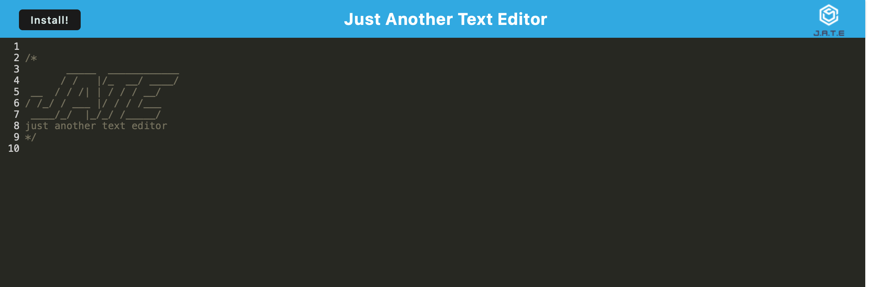

# dans-text-editor
 A web-based text editor

---

### Project Description: 

This is an installable text editor that fits the requirements for a PWA

---

### User Story:

```md
AS A developer
I WANT to create notes or code snippets with or without an internet connection
SO THAT I can reliably retrieve them for later use
```

---

### Deployed Image: 



---
 
* Github URL: 
https://github.com/derekson333/dans-text-editor

* Heroku Deployed Page: 
https://derekson333.github.io/yyyyyyyyy

---


